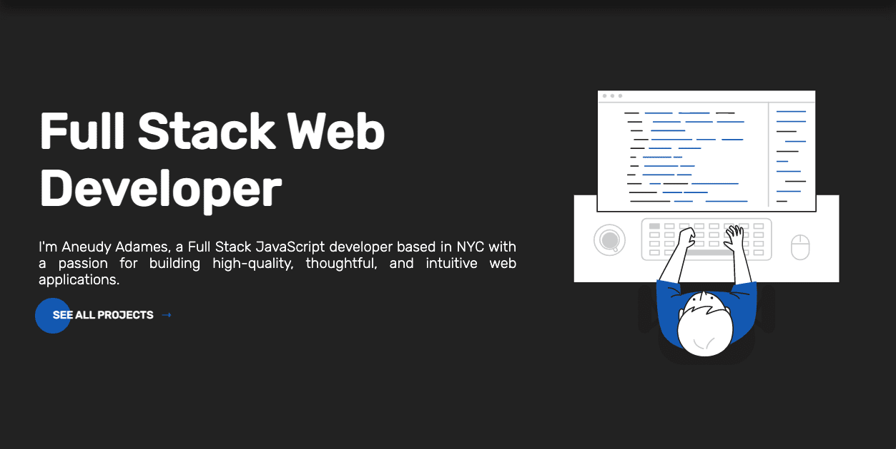
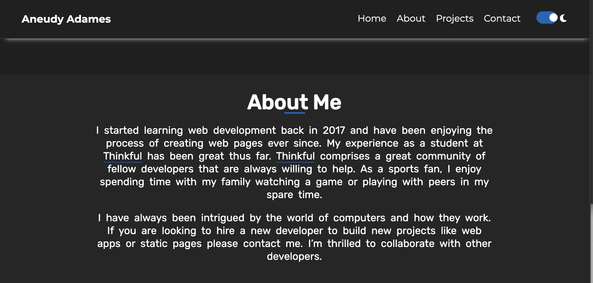
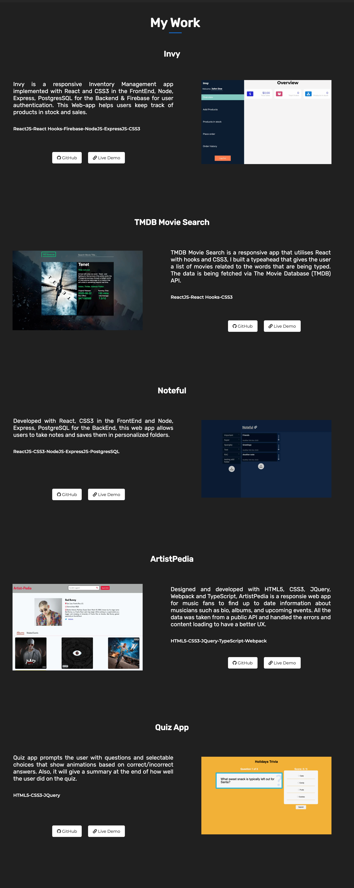
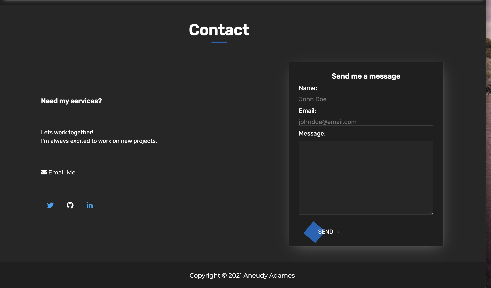
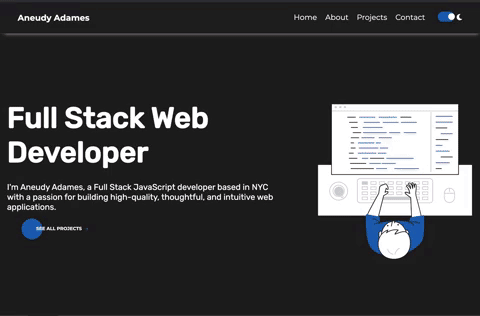
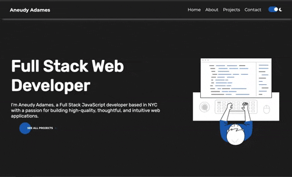

<h1 align="center">Personal Website</h1>

<h2 align="center">

</h2>

  

<h2 align="center"><a  href="https://aneudyadames.dev/">Live</a></h2>

### [Contributions are Welcome](https://github.com/aneudya4/personal-page.git)

## Description

Version 1.0 of my website can be found here!  
<a  href="https://aneudya4.github.io/personal-page/">Live</a>

 

This is my personal website, I built with it HTML5 and CSS3 and JavaScript. The website implements Light-Dark mode and its fully responsive. 

### About Section:

### Projects Section:

### Contact Section:

### Mobile responsive:

### Dark-light Modes:

## Future scope:

- Adding more projects
- Mergin all orders placed by the same client
